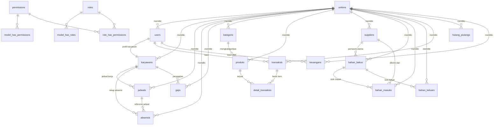

# Database Schema — Kotakin

> Dibuat dari file migrasi di `backend/database/migrations`. **Terakhir diperbarui:** 2026-08-03

---

## Daftar Isi

- [Diagram Relasi (ERD)](#diagram-relasi-erd)
- [Grup Tabel](#grup-tabel)
- [Detail Tabel](#detail-tabel)
- [Ringkasan Foreign Key](#ringkasan-foreign-key)
- [Catatan Arsitektur](#catatan-arsitektur)

---

## Diagram Relasi (ERD)



---

## Grup Tabel

### Core / Auth

| Tabel | Deskripsi |
|---|---|
| `umkms` | Entitas UMKM — tenant utama (multi-tenant) |
| `users` | Akun pengguna, terikat 1 UMKM, email UNIQUE global |
| `password_reset_tokens` | Token reset password |
| `personal_access_tokens` | Token API (Laravel Sanctum) |

### SDM

| Tabel | Deskripsi |
|---|---|
| `karyawans` | Profil karyawan + data wajah untuk absensi |
| `jadwals` | Jadwal kerja per hari per karyawan |
| `absensis` | Rekap kehadiran dengan GPS & foto |
| `gajis` | Slip gaji per periode bulan |

### Inventori & Produk

| Tabel | Deskripsi |
|---|---|
| `kategoris` | Kategori produk |
| `produks` | Katalog produk yang dijual |
| `suppliers` | Data pemasok bahan baku |
| `bahan_bakus` | Master bahan baku & stok |
| `bahan_masuks` | Pencatatan bahan masuk (pembelian) |
| `bahan_keluars` | Pencatatan bahan keluar (pemakaian) |

### Transaksi & Keuangan

| Tabel | Deskripsi |
|---|---|
| `transaksis` | Header transaksi POS/penjualan produk |
| `detail_transaksis` | Item per transaksi POS |
| `hutang_piutangs` | Hutang & piutang kepada supplier/customer |
| `keuangans` | Arus kas umum di luar POS (sewa, listrik, dll) |

### Permission (Spatie)

| Tabel | Deskripsi |
|---|---|
| `permissions` | Daftar izin |
| `roles` | Daftar peran (`super_admin`, `admin`, `kasir`, `karyawan`) |
| `model_has_permissions` | Pivot model ↔ permission |
| `model_has_roles` | Pivot model ↔ role |
| `role_has_permissions` | Pivot role ↔ permission |

### Laravel Internal

| Tabel | Deskripsi |
|---|---|
| `failed_jobs` | Antrian job yang gagal |

---

## Detail Tabel

---

### `umkms`

| Kolom | Tipe | Constraint | Keterangan |
|---|---|---|---|
| `id` | BIGINT UNSIGNED | PK | |
| `nama_umkm` | VARCHAR(150) | NOT NULL | |
| `email_pemilik` | VARCHAR(150) | NOT NULL, UNIQUE | |
| `no_hp` | VARCHAR(20) | NULLABLE | |
| `alamat` | TEXT | NULLABLE | |
| `status_langganan` | ENUM | DEFAULT `trial` | `aktif`, `nonaktif`, `trial` |
| `tanggal_mulai_langganan` | DATE | NULLABLE | |
| `tanggal_berakhir_langganan` | DATE | NULLABLE | |
| `created_at` / `updated_at` | TIMESTAMP | NULLABLE | |

---

### `users`

> **Revisi:** Kolom `role` ENUM dihapus — role dikelola sepenuhnya oleh Spatie Laravel Permission.
> Email kini UNIQUE secara global (1 email = 1 akun = 1 UMKM — Opsi A MVP).

| Kolom | Tipe | Constraint | Keterangan |
|---|---|---|---|
| `id` | BIGINT UNSIGNED | PK | |
| `umkm_id` | BIGINT UNSIGNED | FK → `umkms`, CASCADE | |
| `name` | VARCHAR(150) | NOT NULL | |
| `email` | VARCHAR(150) | NOT NULL, **UNIQUE GLOBAL** | 1 email hanya bisa dimiliki 1 UMKM |
| `email_verified_at` | TIMESTAMP | NULLABLE | |
| `password` | VARCHAR(255) | NOT NULL | Bcrypt hash |
| `is_active` | BOOLEAN | DEFAULT `true` | |
| `remember_token` | VARCHAR(100) | NULLABLE | |
| `created_at` / `updated_at` | TIMESTAMP | NULLABLE | |

---

### `karyawans`

| Kolom | Tipe | Constraint | Keterangan |
|---|---|---|---|
| `id` | BIGINT UNSIGNED | PK | |
| `umkm_id` | BIGINT UNSIGNED | FK → `umkms`, CASCADE | |
| `user_id` | BIGINT UNSIGNED | FK → `users`, CASCADE, UNIQUE | |
| `nip` | VARCHAR(30) | NULLABLE | |
| `no_hp` | VARCHAR(20) | NULLABLE | |
| `alamat` | TEXT | NULLABLE | |
| `jabatan` | VARCHAR(100) | NULLABLE | |
| `tanggal_bergabung` | DATE | NULLABLE | |
| `foto` | VARCHAR(255) | NULLABLE | |
| `face_id_encoding` | TEXT | NULLABLE | Data biometrik wajah |
| `status` | ENUM | DEFAULT `aktif` | `aktif`, `nonaktif`, `resign` |
| `created_at` / `updated_at` | TIMESTAMP | NULLABLE | |
| `deleted_at` | TIMESTAMP | NULLABLE | Soft Delete |

**Constraint:** `UNIQUE(umkm_id, nip)`

---

### `jadwals`

| Kolom | Tipe | Constraint | Keterangan |
|---|---|---|---|
| `id` | BIGINT UNSIGNED | PK | |
| `umkm_id` | BIGINT UNSIGNED | FK → `umkms`, CASCADE | |
| `karyawan_id` | BIGINT UNSIGNED | FK → `karyawans`, CASCADE | |
| `hari` | ENUM | NOT NULL | `senin`, `selasa`, `rabu`, `kamis`, `jumat`, `sabtu`, `minggu` |
| `jam_masuk` | TIME | NOT NULL | |
| `jam_pulang` | TIME | NOT NULL | |
| `shift` | VARCHAR(50) | NULLABLE | |
| `created_at` / `updated_at` | TIMESTAMP | NULLABLE | |

**Constraint:** `UNIQUE(karyawan_id, hari)`

---

### `absensis`

| Kolom | Tipe | Constraint | Keterangan |
|---|---|---|---|
| `id` | BIGINT UNSIGNED | PK | |
| `umkm_id` | BIGINT UNSIGNED | FK → `umkms`, CASCADE | |
| `karyawan_id` | BIGINT UNSIGNED | FK → `karyawans`, CASCADE | |
| `jadwal_id` | BIGINT UNSIGNED | FK → `jadwals`, SET NULL, NULLABLE | |
| `tanggal` | DATE | NOT NULL | |
| `waktu_masuk` | DATETIME | NULLABLE | |
| `waktu_pulang` | DATETIME | NULLABLE | |
| `latitude_masuk` | DECIMAL(10,7) | NULLABLE | |
| `longitude_masuk` | DECIMAL(10,7) | NULLABLE | |
| `latitude_pulang` | DECIMAL(10,7) | NULLABLE | |
| `longitude_pulang` | DECIMAL(10,7) | NULLABLE | |
| `foto_masuk` | VARCHAR(255) | NULLABLE | |
| `foto_pulang` | VARCHAR(255) | NULLABLE | |
| `status` | ENUM | DEFAULT `hadir` | `hadir`, `telat`, `izin`, `sakit`, `alpha` |
| `keterangan` | TEXT | NULLABLE | |
| `created_at` / `updated_at` | TIMESTAMP | NULLABLE | |

**Indeks:** `INDEX(karyawan_id, tanggal)`

---

### `gajis`

| Kolom | Tipe | Constraint | Keterangan |
|---|---|---|---|
| `id` | BIGINT UNSIGNED | PK | |
| `umkm_id` | BIGINT UNSIGNED | FK → `umkms`, CASCADE | |
| `karyawan_id` | BIGINT UNSIGNED | FK → `karyawans`, CASCADE | |
| `periode_bulan` | TINYINT UNSIGNED | NOT NULL | 1–12 |
| `periode_tahun` | SMALLINT UNSIGNED | NOT NULL | |
| `gaji_pokok` | DECIMAL(12,2) | NOT NULL | |
| `tunjangan` | DECIMAL(12,2) | DEFAULT `0` | |
| `potongan` | DECIMAL(12,2) | DEFAULT `0` | |
| `total_gaji` | DECIMAL(12,2) | NOT NULL | |
| `status_pembayaran` | ENUM | DEFAULT `belum_dibayar` | `belum_dibayar`, `dibayar` |
| `tanggal_dibayar` | DATE | NULLABLE | |
| `created_at` / `updated_at` | TIMESTAMP | NULLABLE | |

**Constraint:** `UNIQUE(karyawan_id, periode_bulan, periode_tahun)`

---

### `kategoris`

| Kolom | Tipe | Constraint |
|---|---|---|
| `id` | BIGINT UNSIGNED | PK |
| `umkm_id` | BIGINT UNSIGNED | FK → `umkms`, CASCADE |
| `nama_kategori` | VARCHAR(100) | NOT NULL |
| `created_at` / `updated_at` | TIMESTAMP | NULLABLE |

---

### `produks`

| Kolom | Tipe | Constraint | Keterangan |
|---|---|---|---|
| `id` | BIGINT UNSIGNED | PK | |
| `umkm_id` | BIGINT UNSIGNED | FK → `umkms`, CASCADE | |
| `kategori_id` | BIGINT UNSIGNED | FK → `kategoris`, SET NULL, NULLABLE | |
| `kode_produk` | VARCHAR(50) | NULLABLE | |
| `nama_produk` | VARCHAR(150) | NOT NULL | |
| `harga_jual` | DECIMAL(12,2) | NOT NULL | |
| `stok` | INT | DEFAULT `0` | |
| `gambar` | VARCHAR(255) | NULLABLE | |
| `status` | ENUM | DEFAULT `aktif` | `aktif`, `nonaktif` |
| `created_at` / `updated_at` | TIMESTAMP | NULLABLE | |
| `deleted_at` | TIMESTAMP | NULLABLE | Soft Delete |

**Constraint:** `UNIQUE(umkm_id, kode_produk)`

---

### `suppliers`

| Kolom | Tipe | Constraint |
|---|---|---|
| `id` | BIGINT UNSIGNED | PK |
| `umkm_id` | BIGINT UNSIGNED | FK → `umkms`, CASCADE |
| `nama_supplier` | VARCHAR(150) | NOT NULL |
| `no_hp` | VARCHAR(20) | NULLABLE |
| `alamat` | TEXT | NULLABLE |
| `created_at` / `updated_at` | TIMESTAMP | NULLABLE |

---

### `bahan_bakus`

| Kolom | Tipe | Constraint | Keterangan |
|---|---|---|---|
| `id` | BIGINT UNSIGNED | PK | |
| `umkm_id` | BIGINT UNSIGNED | FK → `umkms`, CASCADE | |
| `supplier_id` | BIGINT UNSIGNED | FK → `suppliers`, SET NULL, NULLABLE | |
| `nama_bahan` | VARCHAR(150) | NOT NULL | |
| `satuan` | VARCHAR(20) | NOT NULL | kg, liter, pcs, dll |
| `stok_saat_ini` | DECIMAL(12,2) | DEFAULT `0` | |
| `stok_minimum` | DECIMAL(12,2) | NULLABLE | Batas peringatan |
| `created_at` / `updated_at` | TIMESTAMP | NULLABLE | |

---

### `bahan_masuks`

| Kolom | Tipe | Constraint |
|---|---|---|
| `id` | BIGINT UNSIGNED | PK |
| `umkm_id` | BIGINT UNSIGNED | FK → `umkms`, CASCADE |
| `bahan_baku_id` | BIGINT UNSIGNED | FK → `bahan_bakus`, CASCADE |
| `supplier_id` | BIGINT UNSIGNED | FK → `suppliers`, SET NULL, NULLABLE |
| `jumlah` | DECIMAL(12,2) | NOT NULL |
| `harga_satuan` | DECIMAL(12,2) | NOT NULL |
| `harga_total` | DECIMAL(12,2) | NOT NULL |
| `tanggal` | DATE | NOT NULL |
| `keterangan` | TEXT | NULLABLE |
| `created_at` / `updated_at` | TIMESTAMP | NULLABLE |

---

### `bahan_keluars`

| Kolom | Tipe | Constraint |
|---|---|---|
| `id` | BIGINT UNSIGNED | PK |
| `umkm_id` | BIGINT UNSIGNED | FK → `umkms`, CASCADE |
| `bahan_baku_id` | BIGINT UNSIGNED | FK → `bahan_bakus`, CASCADE |
| `jumlah` | DECIMAL(12,2) | NOT NULL |
| `tanggal` | DATE | NOT NULL |
| `keterangan` | TEXT | NULLABLE |
| `created_at` / `updated_at` | TIMESTAMP | NULLABLE |

---

### `transaksis`
> Khusus transaksi POS/penjualan produk.

| Kolom | Tipe | Constraint | Keterangan |
|---|---|---|---|
| `id` | BIGINT UNSIGNED | PK | |
| `umkm_id` | BIGINT UNSIGNED | FK → `umkms`, CASCADE | |
| `kasir_id` | BIGINT UNSIGNED | FK → `users`, **SET NULL**, NULLABLE | NULL jika kasir dihapus — data transaksi tetap ada |
| `kode_transaksi` | VARCHAR(50) | NOT NULL | |
| `total` | DECIMAL(12,2) | NOT NULL | |
| `metode_pembayaran` | ENUM | NOT NULL | `tunai`, `qris`, `transfer`, `debit` |
| `tanggal` | DATETIME | NOT NULL | |
| `created_at` / `updated_at` | TIMESTAMP | NULLABLE | |

**Constraint:** `UNIQUE(umkm_id, kode_transaksi)`

---

### `detail_transaksis`

| Kolom | Tipe | Constraint | Keterangan |
|---|---|---|---|
| `id` | BIGINT UNSIGNED | PK | |
| `transaksi_id` | BIGINT UNSIGNED | FK → `transaksis`, CASCADE | |
| `produk_id` | BIGINT UNSIGNED | FK → `produks`, CASCADE | |
| `jumlah` | INT | NOT NULL | Qty |
| `harga_satuan` | DECIMAL(12,2) | NOT NULL | Harga saat transaksi |
| `sub_total` | DECIMAL(12,2) | NOT NULL | jumlah × harga_satuan |
| `created_at` / `updated_at` | TIMESTAMP | NULLABLE | |

---

### `hutang_piutangs` ✨ Baru

| Kolom | Tipe | Constraint | Keterangan |
|---|---|---|---|
| `id` | BIGINT UNSIGNED | PK | |
| `umkm_id` | BIGINT UNSIGNED | FK → `umkms`, CASCADE | |
| `jenis` | ENUM | NOT NULL | `hutang`, `piutang` |
| `nama_pihak` | VARCHAR(150) | NOT NULL | Nama supplier / customer |
| `jumlah` | DECIMAL(12,2) | NOT NULL | |
| `jatuh_tempo` | DATE | NULLABLE | |
| `status` | ENUM | DEFAULT `belum_lunas` | `belum_lunas`, `lunas`, `sebagian` |
| `keterangan` | TEXT | NULLABLE | |
| `created_at` / `updated_at` | TIMESTAMP | NULLABLE | |

**Indeks:** `INDEX(umkm_id, jenis, status)`

---

### `keuangans` ✨ Baru
> Arus kas umum di luar transaksi POS. Digunakan bersama `transaksis` dan `gajis` untuk laporan arus kas total.

| Kolom | Tipe | Constraint | Keterangan |
|---|---|---|---|
| `id` | BIGINT UNSIGNED | PK | |
| `umkm_id` | BIGINT UNSIGNED | FK → `umkms`, CASCADE | |
| `jenis` | ENUM | NOT NULL | `pemasukan`, `pengeluaran` |
| `kategori` | VARCHAR(100) | NOT NULL | sewa, listrik, gaji, lainnya, dll |
| `jumlah` | DECIMAL(12,2) | NOT NULL | |
| `tanggal` | DATE | NOT NULL | |
| `keterangan` | TEXT | NULLABLE | |
| `created_by` | BIGINT UNSIGNED | FK → `users`, **SET NULL**, NULLABLE | NULL jika user dihapus — data keuangan tetap ada |
| `created_at` / `updated_at` | TIMESTAMP | NULLABLE | |

**Indeks:** `INDEX(umkm_id, tanggal)`, `INDEX(umkm_id, jenis)`

---

### Tabel Permission (Spatie Laravel Permission)

#### `permissions`
| Kolom | Tipe | Constraint |
|---|---|---|
| `id` | BIGINT UNSIGNED | PK |
| `name` | VARCHAR(255) | NOT NULL |
| `guard_name` | VARCHAR(255) | NOT NULL |
| `created_at` / `updated_at` | TIMESTAMP | NULLABLE |

**Constraint:** `UNIQUE(name, guard_name)`

#### `roles`
| Kolom | Tipe | Constraint | Keterangan |
|---|---|---|---|
| `id` | BIGINT UNSIGNED | PK | |
| `name` | VARCHAR(255) | NOT NULL | `super_admin`, `admin`, `kasir`, `karyawan` |
| `guard_name` | VARCHAR(255) | NOT NULL | |
| `created_at` / `updated_at` | TIMESTAMP | NULLABLE | |

**Constraint:** `UNIQUE(name, guard_name)`

#### `model_has_permissions` — Pivot polimorfik permission → model
| Kolom | Keterangan |
|---|---|
| `permission_id` | FK → `permissions` |
| `model_type` | Nama class (misal: `App\Models\User`) |
| `model_id` | ID record model |

#### `model_has_roles` — Pivot polimorfik role → model
| Kolom | Keterangan |
|---|---|
| `role_id` | FK → `roles` |
| `model_type` | Nama class |
| `model_id` | ID record model |

#### `role_has_permissions` — Pivot role ↔ permission
| Kolom | Keterangan |
|---|---|
| `permission_id` | FK → `permissions` |
| `role_id` | FK → `roles` |

---

### Tabel Laravel Internal

#### `password_reset_tokens`
| `email` PK | `token` | `created_at` |

#### `failed_jobs`
| `id` PK | `uuid` UNIQUE | `connection` | `queue` | `payload` | `exception` | `failed_at` |

#### `personal_access_tokens`
| Kolom | Keterangan |
|---|---|
| `id` | PK |
| `tokenable_type` + `tokenable_id` | Morph relation |
| `name` | Nama token |
| `token` | VARCHAR(64), UNIQUE |
| `abilities` | TEXT, NULLABLE |
| `last_used_at` / `expires_at` | TIMESTAMP, NULLABLE |

---

## Ringkasan Foreign Key

| Tabel Anak | Kolom FK | Tabel Induk | On Delete |
|---|---|---|---|
| `users` | `umkm_id` | `umkms` | CASCADE |
| `karyawans` | `umkm_id` | `umkms` | CASCADE |
| `karyawans` | `user_id` | `users` | CASCADE |
| `jadwals` | `umkm_id` | `umkms` | CASCADE |
| `jadwals` | `karyawan_id` | `karyawans` | CASCADE |
| `absensis` | `umkm_id` | `umkms` | CASCADE |
| `absensis` | `karyawan_id` | `karyawans` | CASCADE |
| `absensis` | `jadwal_id` | `jadwals` | SET NULL |
| `gajis` | `umkm_id` | `umkms` | CASCADE |
| `gajis` | `karyawan_id` | `karyawans` | CASCADE |
| `kategoris` | `umkm_id` | `umkms` | CASCADE |
| `produks` | `umkm_id` | `umkms` | CASCADE |
| `produks` | `kategori_id` | `kategoris` | SET NULL |
| `suppliers` | `umkm_id` | `umkms` | CASCADE |
| `bahan_bakus` | `umkm_id` | `umkms` | CASCADE |
| `bahan_bakus` | `supplier_id` | `suppliers` | SET NULL |
| `bahan_masuks` | `umkm_id` | `umkms` | CASCADE |
| `bahan_masuks` | `bahan_baku_id` | `bahan_bakus` | CASCADE |
| `bahan_masuks` | `supplier_id` | `suppliers` | SET NULL |
| `bahan_keluars` | `umkm_id` | `umkms` | CASCADE |
| `bahan_keluars` | `bahan_baku_id` | `bahan_bakus` | CASCADE |
| `transaksis` | `umkm_id` | `umkms` | CASCADE |
| `transaksis` | `kasir_id` | `users` | SET NULL |
| `detail_transaksis` | `transaksi_id` | `transaksis` | CASCADE |
| `detail_transaksis` | `produk_id` | `produks` | CASCADE |
| `hutang_piutangs` | `umkm_id` | `umkms` | CASCADE |
| `keuangans` | `umkm_id` | `umkms` | CASCADE |
| `keuangans` | `created_by` | `users` | SET NULL |
| `model_has_permissions` | `permission_id` | `permissions` | CASCADE |
| `model_has_roles` | `role_id` | `roles` | CASCADE |
| `role_has_permissions` | `permission_id` | `permissions` | CASCADE |
| `role_has_permissions` | `role_id` | `roles` | CASCADE |

---

## Catatan Arsitektur

### Role System
- **Tidak ada ENUM `role` di kolom manapun.** Role dikelola sepenuhnya oleh **Spatie Laravel Permission**.
- 4 role default dibuat via `RoleSeeder`: `super_admin`, `admin`, `kasir`, `karyawan` (semua snake_case).
- Hierarki: `super_admin` → `admin` → `kasir` / `karyawan`.

### Login & Email Uniqueness (Opsi A — MVP)
- `email` pada tabel `users` adalah **UNIQUE secara global**.
- 1 email = 1 akun = 1 UMKM. Login cukup dengan `email + password` tanpa memilih UMKM.
- Jika di masa depan dibutuhkan 1 orang bisa kelola >1 UMKM, migrasi ke Opsi B (subdomain/tenant selector).

### Laporan Arus Kas Total
Laporan arus kas menggabungkan data dari 3 sumber:

```
Arus Kas Total =
  transaksis          → pemasukan dari penjualan POS
  + keuangans         → pemasukan & pengeluaran umum (sewa, listrik, dll)
  + gajis             → pengeluaran (filter: status_pembayaran = 'dibayar')
```

### Konsistensi ENUM (snake_case, tanpa spasi)

| Tabel | Kolom | Nilai |
|---|---|---|
| `umkms` | `status_langganan` | `aktif`, `nonaktif`, `trial` |
| `karyawans` | `status` | `aktif`, `nonaktif`, `resign` |
| `jadwals` | `hari` | `senin` .. `minggu` |
| `absensis` | `status` | `hadir`, `telat`, `izin`, `sakit`, `alpha` |
| `gajis` | `status_pembayaran` | `belum_dibayar`, `dibayar` |
| `produks` | `status` | `aktif`, `nonaktif` |
| `transaksis` | `metode_pembayaran` | `tunai`, `qris`, `transfer`, `debit` |
| `hutang_piutangs` | `jenis` | `hutang`, `piutang` |
| `hutang_piutangs` | `status` | `belum_lunas`, `lunas`, `sebagian` |
| `keuangans` | `jenis` | `pemasukan`, `pengeluaran` |
